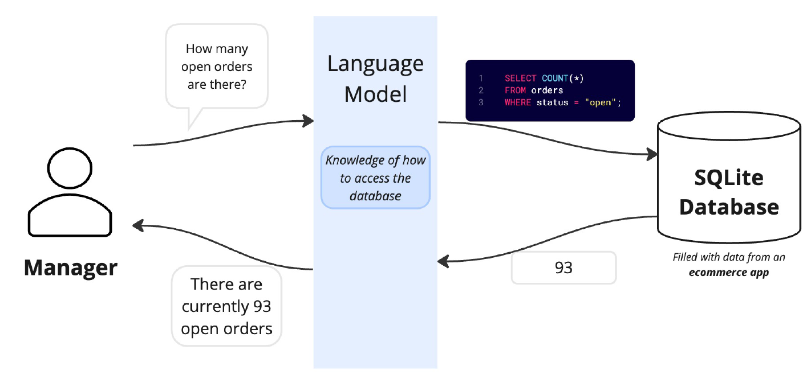
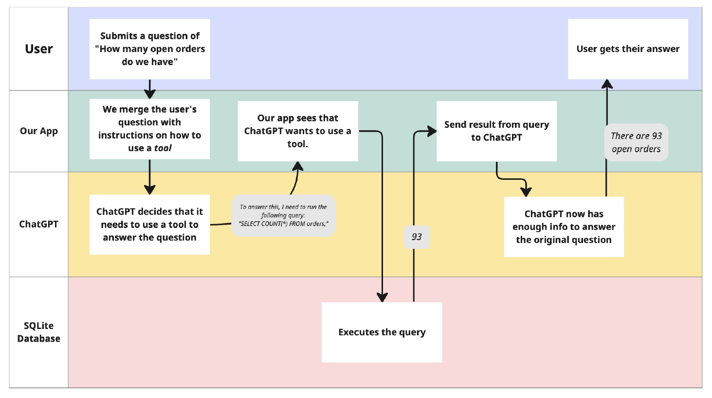

# Langchain Agents
### Installation
- pip install pipenv
- pipenv install

Follow below steps to run the application:
- Create a file called `.env` in the root folder
- Create OpenAI API key using this [link](https://platform.openai.com/account/api-keys)
- Add it in the `.env` file like below (Replace `XXXXX` with your API key):
```text
OPENAI_API_KEY=XXXXX
```
- Run `main.py`

### Agent
- A chain that knows how to use tools
- Will take that list of tools and convert them into JSON function descriptions
- Still has input variables, memory, prompts, etc. - all the normal things a chain has

### Agent Executor
- Takes an agent and runs it until the response is not a function call
- Essentially a fancy while loop

### Application Overview



